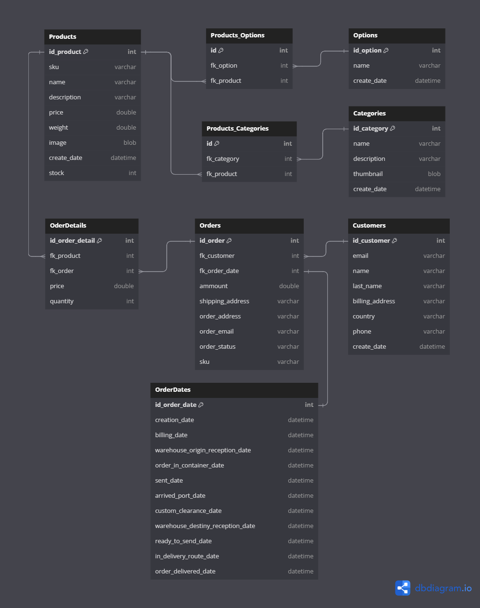

# Ecommerce Backend API


## Description
This project is a simplified REST API developed in Spring framework that allows the management of products and orders of a virtual store with ease.

## Features
- Swagger UI documentation for each of the API endpoints
- Java Development Kit 21.0.4
- Maven 3.9.9
- MySQL 8.0.4
- Manage Customers, Product's Categories, Product's Options, Products, and Orders
- Track all stages of delivery operations
- Works perfectly with any API testing software
- SOLID methodology principles for project structuring
- Spring Framework best practices through the use of DTOs (Data Transfer Object), DAOs (Data Access Object), Controllers, Entities, Mappers, Payloads, and Services
- Easy to use

## Spring Dependencies
- Spring Boot DeVTools
- Lombok
- Srping Web
- JDBC API
- Spring Data JPA
- MySQL Driver
- Validation
- CycloneDX SBOM support
- OpenAPI Springdoc

## Install
1. Before continuing with the installation process you must have JDK 21, Maven 3..9 and MySQL 8 installed on your operating system. If you do not have them, install them and update the Maven and Java environment variables.
   
2. Clone this repository:
   ```bash
   git clone https://github.com/alexdevzz/ecommerce-backend-api.git
   ```
3. Open the project in your favorite IDE
   
4. Go to ```application.yml``` and adjust the database parameters in ```datasource``` (In order to run the application without errors you must have the database previously created, even if it is empty)
   
   
5. Go to ```pom.xml``` and then, check and update maven dependencies
   
6. Then you must compile the Spring Boot application. To do this you must position yourself at the root of the project and package the application using the next command in your console:
   ``` bash
   mvnw package
   ```
   The packaged application file is stored in the new folder ```target```
   
8. We position ourselves in the newly created folder ```target``` and run the previously packaged file:
    ``` bash
    java -jar file_name.jar
    ```

8. Ready !!!

## Database Diagram



   
